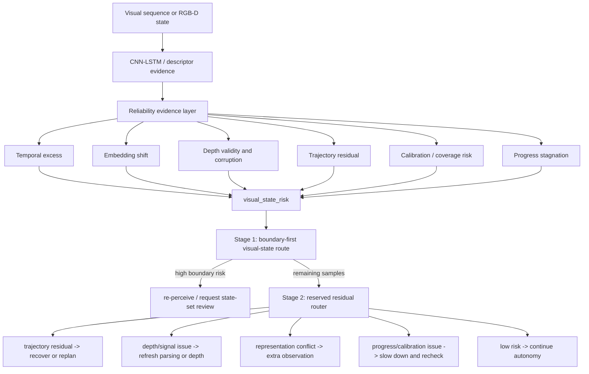
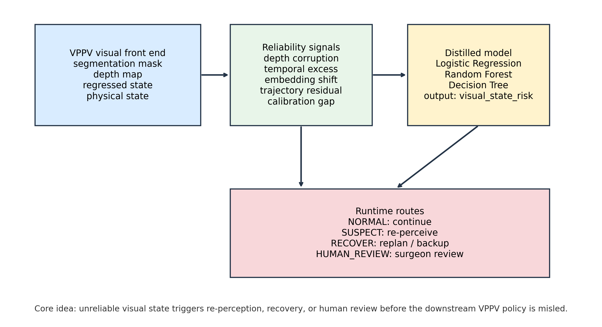
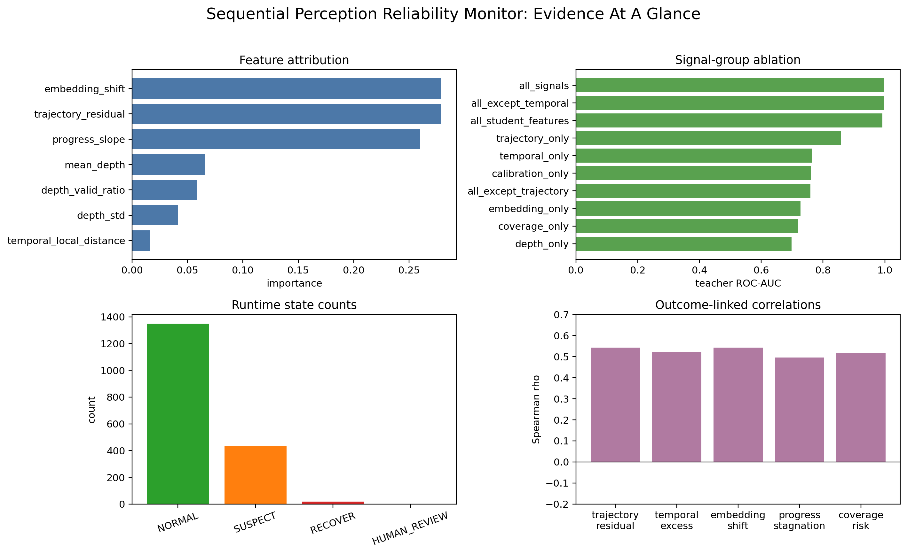
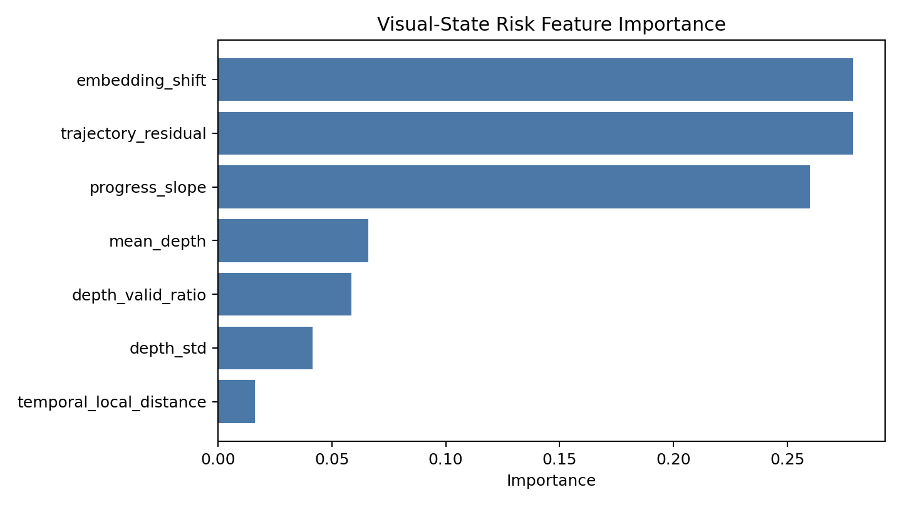
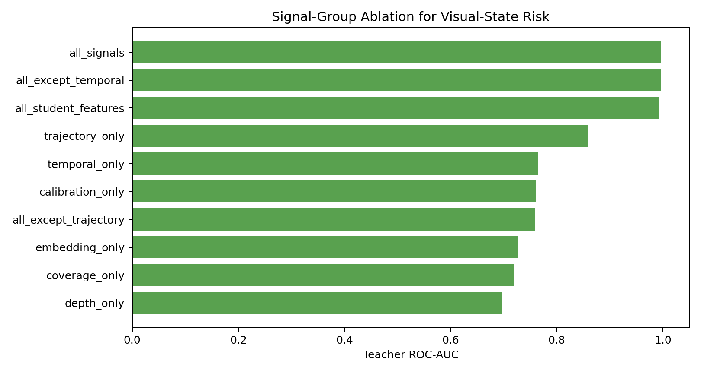
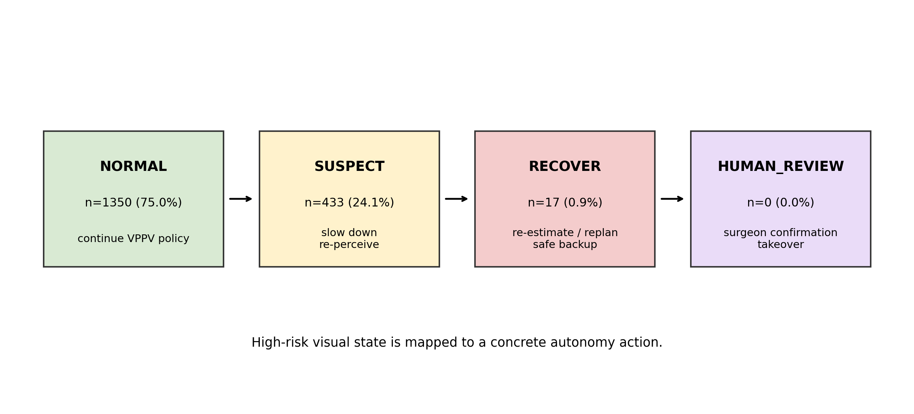
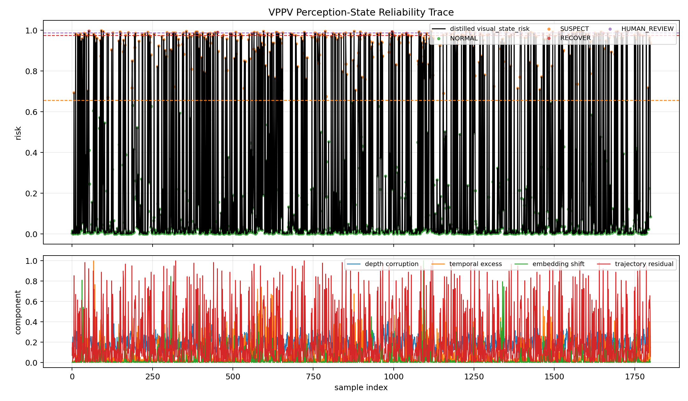

# Industrial Action Recognition To Reliability-Aware Robot Perception

Research code for industrial sensing and reliability-aware robot perception.
The project begins with image/video-based human action recognition in an
industrial setting, then extends that recognition pipeline into a
reliability-aware visual-state monitoring framework.

The original system uses a CNN-LSTM network for visual action recognition:
sample frames from AVI videos, extract image features with a ResNet18 CNN,
model temporal motion with an LSTM, and output the predicted human action
class. This part is the sensor/image-recognition foundation of the project.

The later research upgrade asks a second question: after the model recognizes
an action or visual state, can it also estimate whether that recognition is
reliable enough for a robot or autonomy system to trust?

The central question is therefore not only whether the perception model
predicts a class or state correctly. The main question is:

> When should a robot stop trusting its current visual state and trigger
> re-perception, recovery, replanning, or human review?

This is a research prototype. It is not a certified safety system, not a
closed-loop robot safety proof, and not a reproduction of any surgical autonomy
framework.

## Initial System: Industrial Action Recognition

The first layer of this project is an industrial visual recognition system.
It addresses a practical sensing problem: given short video clips or image
sequences from an industrial/robotic setting, recognize the human action or
visual activity class.

The implemented baseline is:

```text
AVI video / image sequence
  -> sample 16 frames
  -> ResNet18 CNN frame encoder
  -> LSTM temporal sequence model
  -> action-class prediction
  -> validation accuracy, training curves, test predictions, embedding analysis
```

This stage establishes the visual sensing capability of the project. The system
processes image sequences, extracts frame-level visual features, models
temporal motion, and predicts an action class. The later reliability work is
built on top of this recognition layer: once a model can identify an action or
visual state, the next question is whether the system can estimate how
trustworthy that recognition is.

The reliability upgrade therefore plays two roles:

- It supports recognition quality by analyzing confidence, entropy, margins,
  embeddings, and feature-fit style evidence.
- It prepares the recognition model for robot use, where uncertain visual
  states should trigger re-perception, recovery, replanning, or human review
  rather than being accepted automatically.

## Project Summary

This project starts from industrial human action recognition with a ResNet18
CNN plus LSTM video classifier, adds confidence/feature-fit style evidence to
understand and improve recognition reliability, then extends the same logic
into a mechanism-separated runtime router for robot perception.

The repository is organized around three technical components:

- The first capability is visual sequence recognition: image frames, temporal
  motion, and action-class prediction.
- `visual_state_risk` is the lightweight reliability evidence score.
- Mechanism-separated routing is the decision layer: boundary-first visual
  state review, then a reserved residual budget for other failure mechanisms.
- VPPV-style surgical autonomy is used as a transfer case, not as the whole
  project name and not as a claim of surgical validation.

## Research Development

The project is organized as a staged research program.

1. Build an industrial human-action recognition baseline from AVI video:
   ResNet18 extracts frame-level image features and an LSTM models the action
   sequence.
2. Train and evaluate the classifier with train/validation/test splits,
   prediction export, training curves, and validation accuracy.
3. Add recognition-quality analysis: embeddings, confidence, entropy, margins,
   and feature-fit style diagnostics, so the project can explain which visual
   sequences are easy or hard for the model.
4. Inspect embeddings, confidence, and temporal state changes instead of only
   reporting classification accuracy.
5. Test RGB-D/depth reliability under controlled corruption and camera motion.
6. Learn a key negative result: distance from a global clean reference can fail
   under normal camera motion, so reliability must be local and temporal.
7. Add waveform-like temporal excess analysis to detect abnormal visual-state
   changes relative to a local window.
8. Add action-outcome evidence through trajectory residuals, because visual
   reliability matters most when it affects downstream execution.
9. Distill depth, temporal, embedding, trajectory, calibration, and coverage
   signals into `visual_state_risk`.
10. Convert scalar risk into auditable runtime states:
   `NORMAL`, `SUSPECT`, `RECOVER`, and `HUMAN_REVIEW`.
11. Upgrade the scalar monitor into a mechanism-separated hierarchical router:
   Stage 1 handles boundary-like visual-state risk; Stage 2 reserves budget
   for residual mechanisms such as trajectory, depth/signal quality,
   representation conflict, and progress/calibration inconsistency.

The resulting chain is:

```text
industrial video/action data
  -> ResNet18 CNN frame recognition
  -> LSTM temporal action classification
  -> confidence, embedding, and feature-fit diagnostics
  -> RGB-D/depth corruption and camera-motion analysis
  -> local temporal excess scoring
  -> trajectory residual and downstream outcome evidence
  -> visual_state_risk distillation
  -> mechanism-separated runtime routing
  -> VPPV-style surgical-autonomy transfer case
```

## Key Finding

The central finding is that a reliability project should not stop at a better
embedding or a single larger model.

Embedding evidence is useful because it shows when the model's internal visual
state shifts or conflicts with known states. But a cleaner-looking
representation does not automatically prove that a downstream robot decision is
safe. Similarly, a single global distance score can flag normal camera motion
as abnormal.

The final decision policy is therefore not just one risk score. It is a
mechanism-separated router:

1. A boundary-first branch prioritizes abnormal visual-state changes using
   temporal excess, embedding shift, local temporal distance, coverage risk,
   and distilled visual risk.
2. A residual mechanism branch reserves part of the action budget for
   trajectory residual, depth/signal quality, representation conflict, and
   progress/calibration inconsistency.



## Method And Evidence Chain

| Stage | What was done | Why it mattered | Main conclusion |
| --- | --- | --- | --- |
| 1. CNN-LSTM baseline | ResNet18 frame encoder plus LSTM sequence model. | Establishes a concrete sequential perception starting point. | Classification is only the first layer; reliability needs separate evidence. |
| 2. Embedding diagnostics | Validation embeddings, PCA, confidence, entropy, and margins. | Tests whether errors and instability have representation structure. | Embeddings are useful diagnostic evidence, not a safety guarantee by themselves. |
| 3. Synthetic 3D reliability | Controlled depth and point-cloud corruption smoke tests. | Checks whether embedding-risk scoring responds to designed failures. | Multi-seed synthetic depth reliability gives a reproducible signal. |
| 4. Real RGB-D corruption | TUM RGB-D depth profiles with controlled corruption. | Moves from synthetic scenes to real depth frames. | Designed corruptions are detectable, but this is still proxy reliability evidence. |
| 5. Camera-motion audit | Global, grid, and PCA depth descriptors compared against pose change. | Normal robot/camera motion can look like distribution shift. | Global clean-reference distance fails; local and learned descriptors are more promising. |
| 6. Temporal excess | Local window normalization around the current frame. | Reliability should ask whether the current change is abnormal locally. | Temporal excess separates abnormal state changes better than global reference distance. |
| 7. Calibration and coverage | Coverage-risk and calibration-style analyses. | A monitor needs ranking quality and probability caution. | Risk ranking can be strong while raw scores remain poorly calibrated probabilities. |
| 8. Trajectory residual | Planned-vs-observed action outcome residual demo. | Perception reliability matters because it affects execution. | Residuals provide downstream failure evidence beyond visual descriptors. |
| 9. Risk distillation | Random forest, logistic regression, and decision-tree models distilled multi-source signals into `visual_state_risk`. | Heavy analysis must become a lightweight runtime signal. | A compact monitor can approximate richer reliability evidence. |
| 10. Runtime state machine | Risk scores mapped to `NORMAL`, `SUSPECT`, `RECOVER`, `HUMAN_REVIEW`. | Robot systems need auditable actions, not only plots. | Continuous risk can become transparent autonomy states. |
| 11. Mechanism router | Boundary-first route plus reserved residual budget. | Different failure mechanisms need different actions. | This is the clearest current decision layer and the best place to extend the project. |

## Key Results Snapshot

| Evidence layer | Setup | Result | Interpretation |
| --- | ---: | ---: | --- |
| CNN-LSTM action recognition | AVI video/image sequences | ResNet18 frame encoder + LSTM temporal classifier | Demonstrates the original image-sequence recognition capability. |
| Risk distillation | 1800 aligned visual/action samples | Random Forest distillation ROC-AUC 0.992 | `visual_state_risk` approximates heavier reliability evidence. |
| Runtime route states | Distilled risk trace | 1350 NORMAL / 433 SUSPECT / 17 RECOVER / 0 HUMAN_REVIEW | Visual risk becomes concrete autonomy routing. |
| Outcome link | Distilled risk vs residual signals | Top 10% risk captures 100% RECOVER/HUMAN_REVIEW | The risk score is decision-relevant, not only fitted to the distillation target. |
| Mechanism router | 1800 aligned visual/action samples | 20% budget captures 66.7% high-risk target cases and 76.5% RECOVER/HUMAN_REVIEW | Scalar risk is split into boundary-first and residual mechanism routes. |
| Synthetic 3D reliability | 3 seeds, 8 samples per scene | ROC-AUC 0.804 +/- 0.028 | Embedding risk gives a reproducible smoke-test signal. |
| TUM RGB-D corruption | 300 depth files, 1800 samples | Source-paired ROC-AUC 1.000 | Controlled corruptions are detectable in this setup. |
| TUM scene-conditioned baseline | Same TUM run | ROC-AUC 0.483 | Global clean references fail under normal camera motion. |
| TUM temporal reliability | +/- 5 frame window | Temporal excess ROC-AUC 1.000 | Local temporal normalization improves reliability scoring. |
| Pose-aware global descriptor | 299 adjacent frame pairs | Rotation corr. 0.061 | Global statistics are weakly pose-aware. |
| Pose-aware grid descriptor | 299 adjacent frame pairs | Rotation corr. 0.275 | Local layout improves rotation sensitivity. |
| PCA depth descriptor | 32 components | Rotation corr. 0.540 | Lightweight learned depth descriptors are more promising. |
| Runtime monitor | 1800 TUM temporal samples | 1350 NORMAL / 423 SUSPECT / 27 RECOVER | Scores can be converted into auditable runtime states. |
| Calibration | TUM temporal risk scores | ROC-AUC 1.000; ECE gap 0.758 | Ranking is strong, but raw scores are not calibrated probabilities. |
| Trajectory residual | 400 synthetic action-outcome samples | ROC-AUC 0.990 | Planned-vs-observed residuals detect execution failures. |

The CSV version of this table is in
[`docs/tables/key_results.csv`](docs/tables/key_results.csv).

## What Was Learned From The VTVF Upgrade

This project follows a research lesson from the VT/VF ECG reliability work:
do not confuse representation improvement with reliability.

In the ECG project, better-looking VT/VF embeddings did not always reduce
dangerous boundary mistakes. Some interventions improved geometry while moving
errors into another clinically important direction. The useful move was to
turn evidence families into mechanism-specific review routing.

The same logic applies here:

- A CNN-LSTM embedding can expose visual-state conflict, but it is not the
  final decision rule.
- Depth corruption, temporal excess, trajectory residual, calibration risk,
  and progress stagnation are different evidence families.
- A robot should not route every high-risk sample the same way. Some cases need
  re-perception; some need recovery or replanning; some need extra observation;
  some should slow down and recheck state.

The latest implementation of this design is
[`modules/mechanism_router.py`](modules/mechanism_router.py), with the method
summary in
[`docs/mechanism_separated_routing_upgrade.md`](docs/mechanism_separated_routing_upgrade.md).

## VPPV-Style Transfer Case

The VPPV-style section is a transfer case for surgical-autonomy front-end
monitoring. It is not the name of the whole project and does not claim to
reproduce VPPV.

VPPV-style autonomy depends on segmentation masks, depth maps, regressed
perceptual states, physical state vectors, and downstream policy execution.
This project asks whether the reliability monitor can sit beside that front
end and decide whether visual evidence is stable enough for the policy to
trust.

| VPPV-style front-end dependency | Monitor evidence in this project |
| --- | --- |
| Depth map | depth validity, mean depth, depth variance, depth corruption score |
| Perceptual state / embedding | embedding shift and local temporal state change |
| Physical or task progress state | progress slope and progress stagnation score |
| Action outcome consistency | trajectory residual between planned and observed motion |
| Runtime autonomy decision | `NORMAL`, `SUSPECT`, `RECOVER`, `HUMAN_REVIEW`, or mechanism-specific route |

The careful claim is:

> The monitor is VPPV-compatible as a visual-state reliability wrapper, but it
> has not been validated on paired surgical robot logs, segmentation masks,
> VPPV policy rollouts, or real clinical deployment data.

## Selected Figures

These figures are copied from local experiment outputs so the repository can
show representative evidence without committing the full `outputs/` directory.

| Reliability monitor architecture | Visual risk dashboard |
| --- | --- |
|  |  |

| Feature attribution | Signal-group ablation |
| --- | --- |
|  |  |

| Route policy | Risk trace |
| --- | --- |
|  |  |

| Temporal reliability | Runtime monitoring |
| --- | --- |
|  |  |

| Calibration | Trajectory residuals |
| --- | --- |
|  |  |

More selected figures are listed in [`docs/figures/README.md`](docs/figures/README.md).

## Repository Guide

| Document | Purpose |
| --- | --- |
| [`docs/project_overview.md`](docs/project_overview.md) | Technical overview of the research question and pipeline. |
| [`docs/mechanism_separated_routing_upgrade.md`](docs/mechanism_separated_routing_upgrade.md) | Latest VTVF-inspired mechanism-routing upgrade. |
| [`reports/vppv_perception_reliability_monitor.md`](reports/vppv_perception_reliability_monitor.md) | Detailed VPPV-style surgical-autonomy transfer case. |
| [`docs/VISUAL_EVIDENCE_INDEX.md`](docs/VISUAL_EVIDENCE_INDEX.md) | Public figure and table index. |
| [`docs/experiment_order.md`](docs/experiment_order.md) | Recommended order for reading and rerunning experiments. |
| [`docs/limitations.md`](docs/limitations.md) | Scope, limitations, and next validation steps. |
| [`modules/readme.md`](modules/readme.md) | Code map by experimental component. |

## Code Map

```text
modules/
  main.py                              # CNN-LSTM training and prediction entry point
  model.py                             # ResNet18 + LSTM model
  embedding_analysis.py                # Sequential embedding diagnostics
  robot_3d_reliability.py              # Depth/point-cloud reliability utilities
  run_robot_3d_demo.py                 # Synthetic 3D reliability demo
  run_robot_3d_multiseed.py            # Multi-seed synthetic benchmark
  run_robot_3d_pipeline.py             # Real-depth profile + corruption benchmark
  run_temporal_depth_benchmark.py      # Temporal local-reference reliability
  run_tum_pose_embedding_analysis.py   # Global/grid descriptor pose analysis
  run_tum_pca_depth_descriptor.py      # PCA depth descriptor baseline
  calibration_analysis.py              # Calibration and coverage-risk analysis
  trajectory_residual_demo.py          # Action-outcome residual reliability demo
  runtime_monitor.py                   # Converts risk scores into runtime states
  run_vppv_perception_monitor.py       # Risk distillation and transfer case
  mechanism_router.py                  # Boundary-first and reserved-residual routing
```

## Minimal Reproduction

Install dependencies:

```bash
pip install -r modules/requirements.txt
```

Synthetic 3D and trajectory-residual experiments can be run without a robot
dataset:

```bash
python modules/run_robot_3d_demo.py --output-dir outputs/robot_3d_demo
python modules/run_robot_3d_multiseed.py --output-dir outputs/robot_3d_multiseed --seeds 1 2 3 --samples-per-scene 8
python modules/trajectory_residual_demo.py --output-dir outputs/trajectory_residual_demo
```

For the TUM RGB-D workflow:

```bash
python modules/download_tum_rgbd_sample.py \
  --sequence freiburg1_desk \
  --raw-dir data/raw/tum_rgbd \
  --prepared-dir data/prepared_depth/tum_rgbd_freiburg1_desk \
  --max-files 300

python modules/run_temporal_depth_benchmark.py \
  --depth-dir data/prepared_depth/tum_rgbd_freiburg1_desk \
  --output-dir outputs/tum_rgbd_freiburg1_desk_temporal \
  --depth-scale 5000 \
  --max-files 300 \
  --window 5

python modules/runtime_monitor.py \
  --input-csv outputs/tum_rgbd_freiburg1_desk_temporal/temporal_depth_embeddings.csv \
  --output-dir outputs/tum_rgbd_runtime_monitor \
  --score-column temporal_excess_score

python modules/run_vppv_perception_monitor.py

python modules/mechanism_router.py \
  --input-csv outputs/vppv_perception_monitor/risk_trace.csv \
  --output-dir outputs/mechanism_router \
  --action-budget 0.20 \
  --residual-reserve 0.20
```

Raw data, prepared subsets, checkpoints, and generated outputs are intentionally
not tracked by Git. See [`data/README.md`](data/README.md).

## What This Does Not Prove

- It does not prove closed-loop robot safety.
- It does not validate a surgical autonomy system on real surgical rollouts.
- Current labels are proxy reliability labels, not natural task failure labels.
- Controlled corruptions do not replace real failures caused by lighting,
  occlusion, tissue deformation, smoke, blur, sensor degradation, or policy
  mistakes.
- PCA descriptors are diagnostic baselines, not general pretrained RGB-D
  representations.
- Runtime states and mechanism routes are transparent research rules, not
  formal safety guarantees.

## Best Next Experiment

Replace proxy labels with task-native failure evidence: robot-log failures,
SLAM tracking loss, segmentation-mask quality, depth-estimation error,
surgical-tool state regression error, simulator rollouts, or real
action-outcome residuals. Then evaluate whether `visual_state_risk` and the
mechanism router improve failure capture under a fixed action or human-review
budget.
