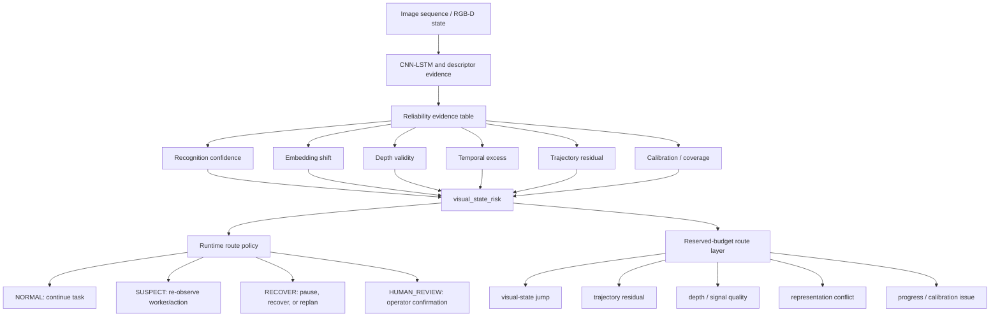
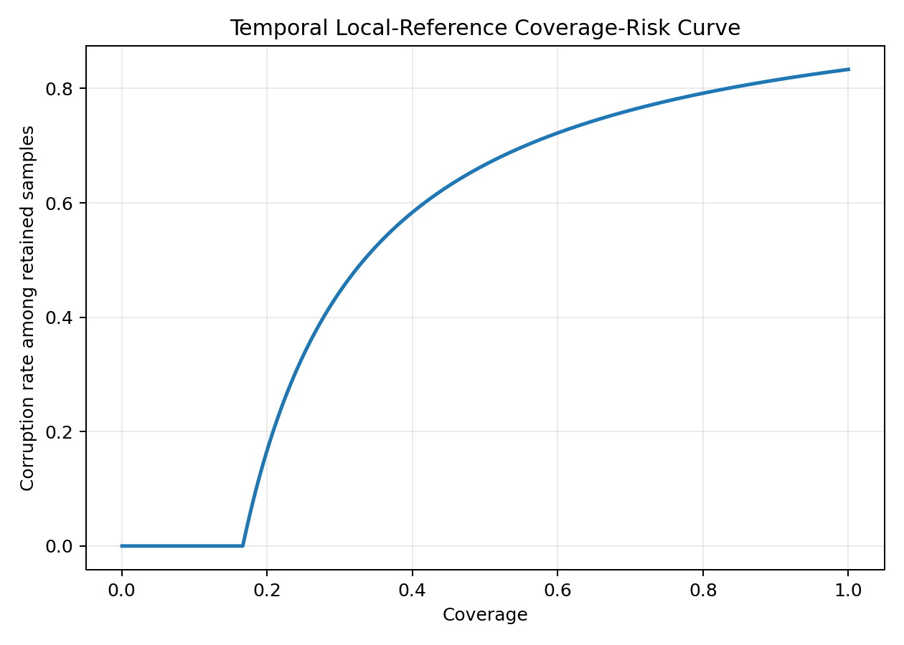
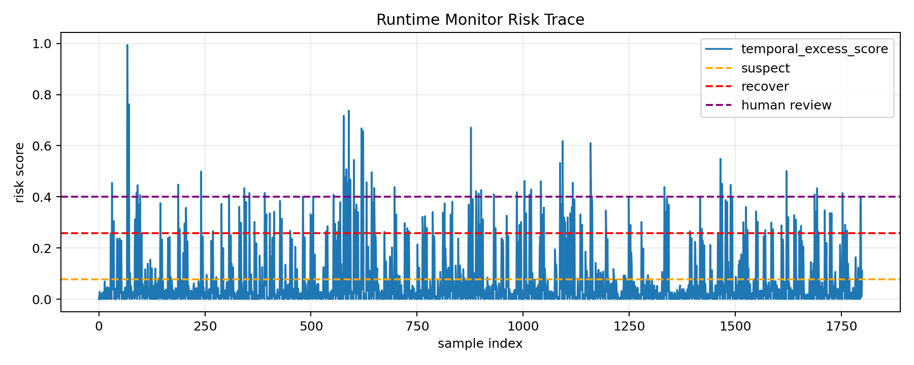
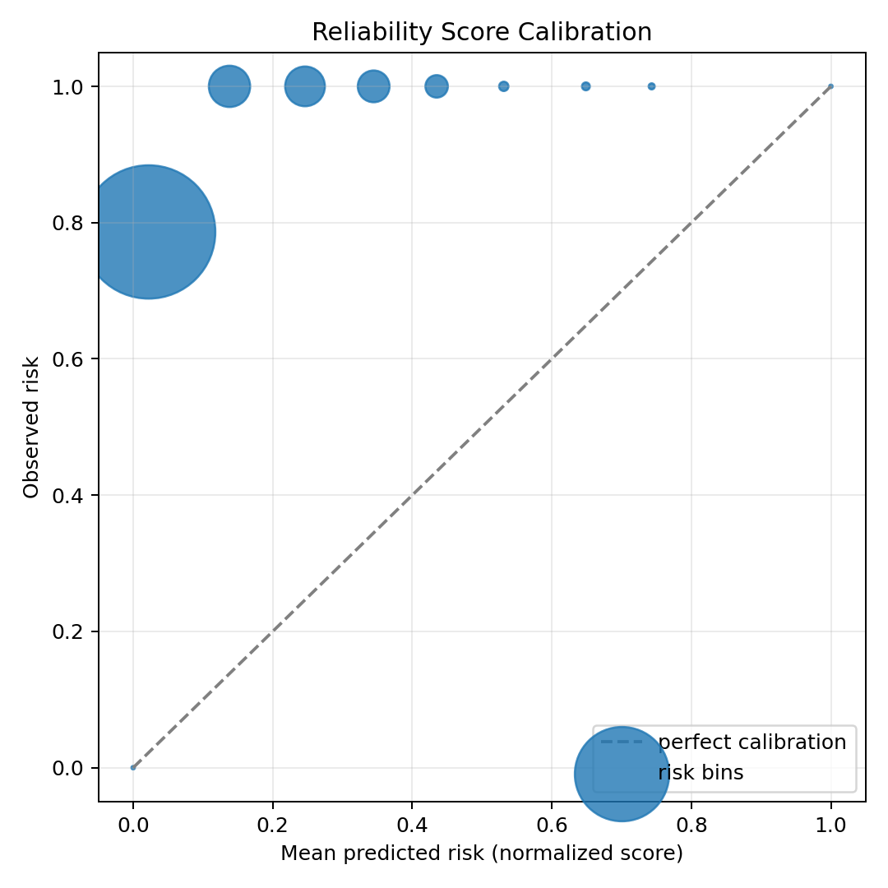
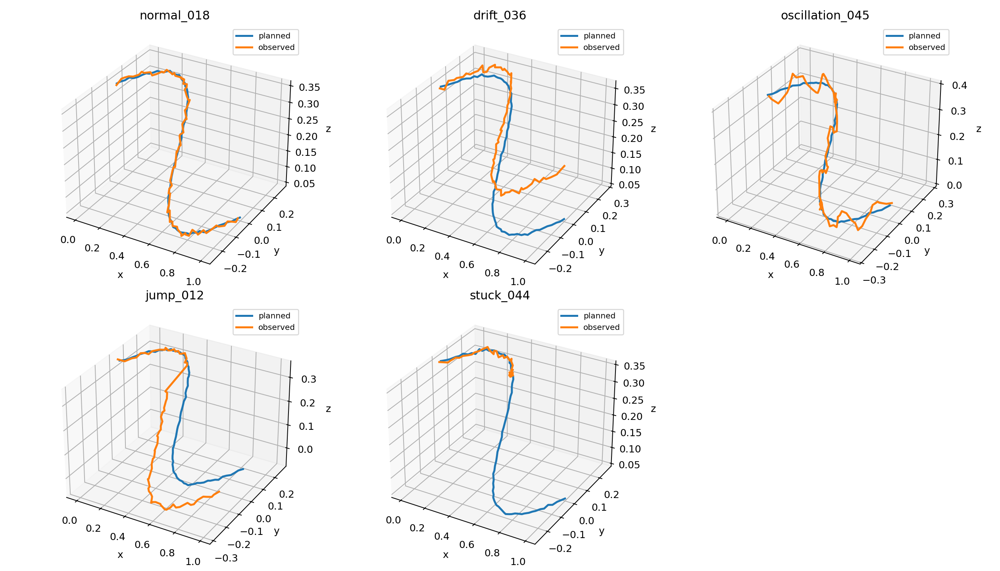

# Visual-State Reliability for Industrial Action Recognition and Robot Perception

This repository studies how an industrial visual recognition system can be
extended into a reliability-aware robot perception monitor. The project begins
with CNN-LSTM human action recognition from image/video sequences in an
industrial workcell, then asks whether the same visual pipeline can estimate
when its own action or visual-state estimate is too unreliable for autonomous
use.

The work is a research prototype. It is not a certified safety system, not a
closed-loop robot validation result, and not a reproduction of any external
autonomy framework.

## Current Maturity

| Layer | Current status | Claim level |
| --- | --- | --- |
| CNN-LSTM visual action recognition | Implemented training, prediction, and embedding diagnostics. | Implemented baseline. |
| Reliability evidence analysis | Implemented with confidence, entropy, embeddings, temporal/depth signals, calibration, and residual proxies. | Research prototype evidence. |
| Graded runtime response | Implemented as a rule-based / fixed-budget routing demo. | Proof-of-concept monitor, not validated industrial control. |
| Industrial closed-loop validation | Not yet performed with real workcell robot logs or task failures. | Future work. |

## Core Problem

Industrial human-robot interaction cannot stop at recognizing that a worker is
reaching, placing, assembling, waiting, or entering a work zone. A robot also
needs to know whether the current action estimate is reliable enough to use.
If the action is misrecognized or visually ambiguous, the downstream system
should not blindly continue the same behavior.

The central question is:

> Can an industrial action-recognition model be upgraded with reliability
> evidence so that a prototype monitor can indicate when to continue,
> re-observe the worker, pause or recover the robot action, or request human
> confirmation?

## Research Path

The project is organized around a recognition-to-reliability progression:

```text
industrial image/video action recognition
  -> ResNet18 frame encoder + LSTM temporal classifier
  -> validation embeddings, confidence, entropy, and margins
  -> RGB-D/depth corruption and camera-motion stress tests
  -> local temporal excess scoring for abnormal visual-state changes
  -> trajectory residuals as downstream action-outcome evidence
  -> visual_state_risk distillation
  -> proof-of-concept evidence-to-action monitor
```

This structure keeps the initial visual-recognition capability visible while
making the reliability upgrade explicit.

## 1. Industrial Action Recognition Baseline

The first system is a CNN-LSTM video classifier for industrial human-action
recognition. It processes AVI videos or image sequences, samples a fixed number
of frames, extracts image features, models temporal motion, and predicts an
action class.

```text
AVI video / image sequence
  -> 16 sampled frames
  -> ResNet18 CNN frame encoder
  -> LSTM temporal model
  -> action-class prediction
  -> training curves, validation accuracy, test predictions
  -> validation embedding diagnostics
```

Relevant code:

- `modules/main.py`: training and prediction entry point.
- `modules/model.py`: ResNet18 + LSTM model.
- `modules/data_loader.py`: frame sampling and video loading.
- `modules/embedding_analysis.py`: validation embeddings, confidence,
  entropy, margins, PCA, and distribution summaries.

This stage establishes that the project can process visual sensor data and
perform temporal action recognition. The later reliability components are built
around the question of when such recognition should or should not be trusted.

## 2. Reliability Question

The reliability layer is motivated by three observations.

First, a wrong action label can change the robot response. If a worker's action
is uncertain, the system may need another observation instead of continuing
from a possibly wrong state.

Second, visual embeddings can reveal instability, but embedding separation is
not by itself a safety guarantee. A representation can look cleaner while the
downstream decision remains fragile.

Third, perception reliability must be connected to action outcomes. A visual
state is high risk when it can mislead downstream control, recovery, replanning,
or human-review decisions.

The proposed industrial decision layer is:

| Monitor state | Industrial interpretation | Candidate response |
| --- | --- | --- |
| `NORMAL` | Action estimate is stable and consistent. | Continue the planned robot or monitoring behavior. |
| `SUSPECT` | Recognition evidence is weak, changing, or visually inconsistent. | Re-observe the worker, slow down, or request another frame/window. |
| `RECOVER` | Visual state may already be affecting execution. | Pause, recover, replan, or return to a safer robot state. |
| `HUMAN_REVIEW` | The system cannot confirm the worker/action state automatically. | Ask an operator to confirm before continuing. |

## 3. Evidence Families

The project separates reliability evidence into distinct signal families rather
than treating all uncertainty as one scalar.

| Evidence family | Measured signals | Reliability role |
| --- | --- | --- |
| Visual recognition | predicted class, confidence, entropy, probability margin | Identifies uncertain or low-margin action predictions. |
| Embedding geometry | validation embeddings, PCA, embedding shift | Detects representation drift and visual-state conflict. |
| Depth and RGB-D quality | valid-depth ratio, mean depth, depth variance, corruption score | Flags degraded or implausible depth evidence. |
| Temporal state change | local temporal distance, temporal excess score | Separates abnormal state jumps from normal motion. |
| Calibration and coverage | calibration gap, coverage-risk ranking | Distinguishes ranking quality from calibrated probability claims. |
| Action outcome | planned-vs-observed trajectory residual, progress slope | Connects recognition reliability to downstream execution. |

This design mirrors the main methodological lesson from the related ECG
reliability project without reusing its naming scheme: diagnostic evidence
should generate testable reliability routes, not serve as proof by itself.

## 4. Evidence-To-Action Monitor

The current proof-of-concept runtime design has two layers.

The first layer distills multi-source reliability evidence into
`visual_state_risk`, a lightweight score that can be computed from visual,
temporal, depth, trajectory, progress, calibration, and coverage signals.

The second layer converts risk and dominant evidence type into actions. The
implementation is intentionally transparent: the monitor exposes why a sample
is risky and routes it to a matching response.



The route policy is not a formal safety controller and has not been validated
in a real industrial robot loop. It is an auditable research wrapper that turns
action-recognition evidence into explicit candidate runtime responses.

## 5. Main Findings

| Claim | Evidence | Interpretation |
| --- | --- | --- |
| CNN-LSTM provides the initial visual recognition layer. | ResNet18 frame encoder, LSTM sequence model, validation metrics, and exported predictions. | The project begins with image-sequence recognition rather than only post-hoc uncertainty analysis. |
| Low-confidence or unstable recognition should not be treated as a normal action estimate. | Confidence, entropy, margin, embedding, and temporal diagnostics are exported after validation. | The system can separate action prediction from action reliability. |
| Controlled depth corruptions are detectable. | TUM RGB-D source-paired corruption benchmark, 300 depth files and 1800 samples. | The reliability pipeline detects designed depth failures, but this remains proxy evidence. |
| Global clean-reference distance can fail under camera motion. | TUM scene-conditioned baseline ROC-AUC 0.483. | Robot visual reliability should not be defined only as distance from a global clean state. |
| Local temporal normalization improves reliability scoring. | Temporal excess benchmark with +/- 5 frame local window, ROC-AUC 1.000. | Abnormal visual-state changes are better evaluated relative to local motion context. |
| Risk ranking is stronger than probability calibration. | TUM calibration analysis: ROC-AUC 1.000 with ECE gap 0.758. | Scores can rank risk well without being calibrated probabilities. |
| Action residuals provide execution-facing evidence. | Synthetic planned-vs-observed trajectory residual demo, ROC-AUC 0.990. | Reliability monitoring should connect perception to downstream outcomes. |
| Multi-source risk can be distilled into a compact runtime score. | Visual-state risk distillation, Random Forest distillation ROC-AUC 0.992. | `visual_state_risk` approximates heavier reliability evidence. |
| A fixed-budget router can prioritize high-risk states in a demo setting. | 20% action budget captures 66.7% high-risk target cases and 76.5% RECOVER/HUMAN_REVIEW states. | The monitor demonstrates review or recovery triage logic under limited action budget. |

The CSV version of the result snapshot is stored in
`docs/tables/key_results.csv`.

## 6. Current Evidence Snapshot

| Evidence layer | Setup | Result | Interpretation |
| --- | ---: | ---: | --- |
| CNN-LSTM action recognition | AVI video/image sequences | ResNet18 frame encoder + LSTM temporal classifier | Initial image-sequence recognition capability. |
| Risk distillation | 1800 aligned visual/action samples | Random Forest distillation ROC-AUC 0.992 | Compact risk score approximates richer reliability evidence. |
| Runtime route states | Distilled risk trace | 1350 NORMAL / 433 SUSPECT / 17 RECOVER / 0 HUMAN_REVIEW | Continuous risk becomes auditable autonomy routing. |
| Outcome link | Distilled risk vs residual signals | Top 10% risk captures 100% RECOVER/HUMAN_REVIEW | Risk is decision-relevant, not only fitted to the distillation target. |
| Reserved-budget router | 1800 aligned visual/action samples | 20% budget captures 66.7% high-risk target cases and 76.5% RECOVER/HUMAN_REVIEW | Scalar risk is decomposed into route-specific actions. |
| Synthetic 3D reliability | 3 seeds, 8 samples per scene | ROC-AUC 0.804 +/- 0.028 | Embedding-risk scoring gives a reproducible smoke-test signal. |
| TUM RGB-D corruption | 300 depth files, 1800 samples | Source-paired ROC-AUC 1.000 | Controlled corruptions are detectable in this setup. |
| TUM scene-conditioned baseline | Same TUM run | ROC-AUC 0.483 | Global clean references fail under normal camera motion. |
| TUM temporal reliability | +/- 5 frame window | Temporal excess ROC-AUC 1.000 | Local temporal normalization improves reliability scoring. |
| Pose-aware global descriptor | 299 adjacent frame pairs | Rotation corr. 0.061 | Global statistics are weakly pose-aware. |
| Pose-aware grid descriptor | 299 adjacent frame pairs | Rotation corr. 0.275 | Local layout improves rotation sensitivity. |
| PCA depth descriptor | 32 components | Rotation corr. 0.540 | Lightweight learned depth descriptors are more promising. |
| Calibration | TUM temporal risk scores | ROC-AUC 1.000; ECE gap 0.758 | Ranking is strong, but raw scores are not calibrated probabilities. |
| Trajectory residual | 400 synthetic action-outcome samples | ROC-AUC 0.990 | Planned-vs-observed residuals detect execution failures. |

## 7. Primary Use Case: Industrial Runtime Action Monitoring

The primary application scenario is an industrial workcell or human-robot
collaboration setting. A camera-based system recognizes worker actions or
visual activity states. The reliability monitor then decides whether the
recognized state can be used directly.

Example runtime logic:

```text
worker image sequence
  -> CNN-LSTM predicts action/state
  -> reliability evidence checks confidence, embedding, temporal consistency,
     depth quality, and action-outcome consistency
  -> route decision:
       NORMAL       continue task
       SUSPECT      re-observe or slow down
       RECOVER      pause / recover / replan
       HUMAN_REVIEW request operator confirmation
```

This is the intended project-level output. In the current repository, the
graded response layer is a proof-of-concept monitor built from proxy evidence,
not a validated industrial robot controller.

## 8. Future Extension: Visual-State Consistency

One useful future extension is a visual-to-state consistency check: the system
would convert camera evidence into an action or scene state, then verify
whether later visual evidence, temporal motion, depth quality, and action
outcome remain consistent with that state.

This idea fits the project because industrial robots often need to act on a
visual state estimate rather than on a raw image. However, the current
repository should not present this as a completed closed-loop module. The
implemented contribution is the industrial CNN-LSTM recognition baseline, the
multi-source reliability evidence, and the proof-of-concept route policy.

## 9. Selected Visual Evidence

| Temporal reliability | Runtime monitoring |
| --- | --- |
|  |  |

| Calibration | Trajectory residuals |
| --- | --- |
|  |  |

More selected figures are listed in `docs/figures/README.md`.

## 10. Repository Map

```text
modules/
  main.py                              CNN-LSTM training and prediction entry point
  model.py                             ResNet18 + LSTM model
  data_loader.py                       Video loading and frame sampling
  embedding_analysis.py                Embedding, confidence, entropy, PCA diagnostics
  robot_3d_reliability.py              Depth/point-cloud reliability utilities
  run_temporal_depth_benchmark.py      Local temporal-reference reliability
  run_tum_pose_embedding_analysis.py   Global/grid descriptor pose sensitivity
  run_tum_pca_depth_descriptor.py      PCA depth descriptor baseline
  calibration_analysis.py              Calibration and coverage-risk analysis
  trajectory_residual_demo.py          Action-outcome residual reliability demo
  runtime_monitor.py                   Risk scores to runtime states
  mechanism_router.py                  Reserved-budget route policy

docs/
  project_overview.md                  Technical overview
  mechanism_separated_routing_upgrade.md
  limitations.md                       Evidence boundary and next validation steps
  VISUAL_EVIDENCE_INDEX.md             Public figure and table index
```

## 11. Reproduce Key Runs

Install dependencies:

```bash
pip install -r modules/requirements.txt
```

Synthetic 3D and trajectory-residual smoke tests:

```bash
python modules/run_robot_3d_demo.py --output-dir outputs/robot_3d_demo
python modules/run_robot_3d_multiseed.py --output-dir outputs/robot_3d_multiseed --seeds 1 2 3 --samples-per-scene 8
python modules/trajectory_residual_demo.py --output-dir outputs/trajectory_residual_demo
```

TUM RGB-D reliability workflow:

```bash
python modules/download_tum_rgbd_sample.py \
  --sequence freiburg1_desk \
  --raw-dir data/raw/tum_rgbd \
  --prepared-dir data/prepared_depth/tum_rgbd_freiburg1_desk \
  --max-files 300

python modules/run_temporal_depth_benchmark.py \
  --depth-dir data/prepared_depth/tum_rgbd_freiburg1_desk \
  --output-dir outputs/tum_rgbd_freiburg1_desk_temporal \
  --depth-scale 5000 \
  --max-files 300 \
  --window 5

python modules/runtime_monitor.py \
  --input-csv outputs/tum_rgbd_freiburg1_desk_temporal/temporal_depth_embeddings.csv \
  --output-dir outputs/tum_rgbd_runtime_monitor \
  --score-column temporal_excess_score
```

Route-policy run from a prepared risk trace:

```bash
python modules/mechanism_router.py \
  --input-csv <risk_trace.csv> \
  --output-dir outputs/mechanism_router \
  --action-budget 0.20 \
  --residual-reserve 0.20
```

Raw data, prepared subsets, checkpoints, and generated outputs are intentionally
not tracked by Git. See `data/README.md`.

## Evidence Boundary

- Current reliability labels are proxy labels, not natural task-failure labels.
- Controlled corruptions do not replace real perception failures caused by
  lighting, occlusion, deformation, smoke, blur, sensor degradation, or policy
  mistakes.
- Temporal and depth benchmarks show internal evidence, not closed-loop robot
  safety.
- Calibration results support risk ranking, not calibrated probability
  deployment.
- Visual-to-state consistency is a proposed future extension, not a completed
  external-framework validation.
- Runtime states and route policies are transparent research rules, not formal
  safety guarantees.

## Next Validation Step

The strongest next experiment is to replace proxy labels with task-native
industrial evidence: human-action misrecognition cases, worker-zone events,
robot stop/replan logs, near-miss annotations, perception dropouts, or real
action-outcome residuals. The key evaluation should ask whether
`visual_state_risk` and the route policy improve unsafe or incorrect action
handling under a fixed re-observation, recovery, or human-review budget.
