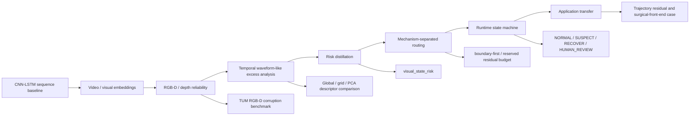
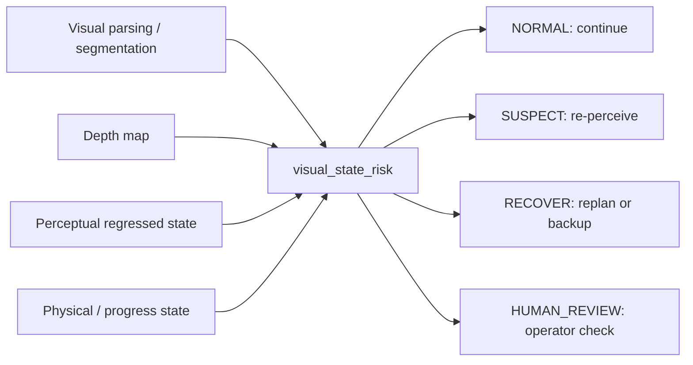

# Project Overview

This repository is framed as a reliability-aware sequential robot perception
project. The research path is:

1. CNN-LSTM sequence perception.
2. Embedding and temporal-state diagnostics.
3. RGB-D/depth reliability under corruption and camera motion.
4. Waveform-like temporal excess analysis for abnormal state changes.
5. Runtime risk distillation and route-state monitoring.
6. Mechanism-separated hierarchical routing with a reserved residual budget.
7. Optional transfer to surgical autonomy front ends such as VPPV-style systems.

## Core Question

Can depth, temporal, embedding, trajectory, calibration, and coverage-risk
signals be distilled into a lightweight `visual_state_risk` score and then
separated into mechanism-specific routes that tell a robot when to continue,
re-perceive, recover, replan, or request human review?

## Pipeline

## Evidence Summary

| Layer | Dataset / setup | Key result | Interpretation |
|---|---:|---:|---|
| Risk distillation | 1800 aligned visual/action samples | Random Forest teacher ROC-AUC 0.992 | Depth/temporal/embedding/trajectory evidence becomes `visual_state_risk` |
| Route evaluation | Distilled risk states | 1350 NORMAL, 433 SUSPECT, 17 RECOVER, 0 HUMAN_REVIEW | Risk maps to concrete autonomy actions |
| Outcome-linked validation | Risk vs downstream signals | Top 10% risk captures 100% RECOVER/HUMAN_REVIEW | The score is decision-relevant, not only a teacher fit |
| Mechanism router | VPPV risk trace | 20% budget captures 66.7% teacher high-risk and 76.5% RECOVER/HUMAN_REVIEW | Scalar risk becomes mechanism-specific routing |
| Synthetic 3D reliability | Synthetic depth corruptions | ROC-AUC 0.804 +/- 0.028 | Smoke evidence for embedding-risk scoring |
| TUM RGB-D corruption | 300 depth files, 1800 samples | source-paired ROC-AUC 1.000 | Controlled corruptions are detectable |
| TUM scene-conditioned baseline | Same TUM run | ROC-AUC 0.483 | Global clean references fail under camera motion |
| TUM temporal reliability | +/- 5 frame window | temporal excess ROC-AUC 1.000 | Local temporal normalization helps |
| Pose-aware global descriptor | TUM ground-truth poses | rotation corr. 0.061 | Global statistics are not pose-aware |
| Pose-aware grid descriptor | TUM ground-truth poses | rotation corr. 0.275 | Local layout improves rotation sensitivity |
| PCA depth descriptor | TUM ground-truth poses | rotation corr. 0.540 | Learned depth descriptors are more promising |
| Runtime monitor | TUM temporal risk scores | 1350 NORMAL, 423 SUSPECT, 27 RECOVER | Scores can become auditable runtime states |
| Calibration | TUM temporal risk scores | ROC-AUC 1.000, ECE gap 0.758 | Good ranking, poor probability calibration |
| Trajectory residual | Synthetic action failures | ROC-AUC 0.990 | Action-outcome residuals detect execution failures |

## What This Shows

- The project is best described as a general reliability monitor for sequential
  robot perception, not as a project named after one surgical framework.
- `visual_state_risk` distills heavier reliability evidence into a lightweight
  runtime score.
- Mechanism-separated routing keeps embedding, temporal, depth, trajectory, and
  progress evidence as different failure signals rather than collapsing every
  case into one undifferentiated review bucket.
- Naive embedding distance can fail under normal camera motion.
- Local and learned descriptors improve pose-awareness, especially for rotation.
- Reliability scores can be converted into runtime states and recovery actions.
- Action-outcome residuals extend the project from perception to execution.
- A VPPV-style surgical autonomy front end is one credible transfer target.

## VPPV-Style Transfer Case

The VPPV-style section is used to demonstrate how the same reliability monitor
would attach to a policy-driven surgical autonomy pipeline. The mapping is:

This transfer is academically useful because it preserves the broad method
while showing a concrete high-stakes use case. It also gives a careful claim:
the monitor is VPPV-compatible in spirit, but it is not a VPPV reproduction and
has not yet been validated on paired surgical policy rollouts.

## What It Does Not Prove

- It does not prove closed-loop robot safety.
- Controlled corruptions do not replace real task failure labels.
- PCA descriptors are sequence-fitted baselines, not general pretrained models.
- Runtime state rules are auditable prototypes, not formal safety proofs.
- The surgical-autonomy case is a transfer framing, not a claim of reproducing
  VPPV itself.

## Supervisor Reading Guide

| Supervisor direction | Read first |
|---|---|
| Reliable robot perception | TUM temporal and pose-aware sections in this overview |
| Trustworthy ML / calibration | `docs/application_evidence_pack.md`, calibration section |
| Runtime assurance / formal methods | `docs/application_evidence_pack.md`, runtime monitor section |
| Embodied AI / navigation | Temporal state-change and route-state sections |
| Transferability estimation | Descriptor comparison: global -> grid -> PCA |
| Mechanism-routing upgrade | `docs/mechanism_separated_routing_upgrade.md` |
| Surgical robotics / VPPV | `reports/vppv_perception_reliability_monitor.md` as an application case |

## Best Next Experiment

Replace the current proxy labels with task-native evidence: robot-log failures,
SLAM tracking quality, segmentation-mask quality, surgical-tool state regression
error, simulator rollouts, or real action-outcome residuals. Then evaluate
whether `visual_state_risk` predicts downstream failures and reduces unsafe
execution through re-perception, recovery, or human review.
