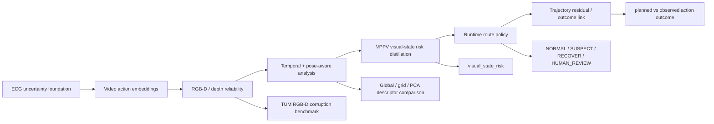

# Project Overview

This repository is now framed as a VPPV-style perception reliability monitor.
The original sequential, RGB-D, temporal, calibration, and trajectory residual
experiments are used as evidence layers for one question: when should a
surgical autonomy pipeline stop trusting its visual front-end state?

## Core Question

Can depth, temporal, embedding, trajectory, calibration, and coverage-risk
signals be distilled into a lightweight `visual_state_risk` score that routes a
VPPV-style system to continue, re-perceive, recover, replan, or request human
review?

## Pipeline

## Evidence Summary

| Layer | Dataset / setup | Key result | Interpretation |
|---|---:|---:|---|
| VPPV risk distillation | 1800 aligned visual/action samples | Random Forest teacher ROC-AUC 0.992 | Depth/temporal/embedding/trajectory evidence becomes `visual_state_risk` |
| VPPV route evaluation | Distilled risk states | 1350 NORMAL, 433 SUSPECT, 17 RECOVER, 0 HUMAN_REVIEW | Risk maps to concrete VPPV autonomy actions |
| Outcome-linked validation | Risk vs downstream signals | Top 10% risk captures 100% RECOVER/HUMAN_REVIEW | The score is decision-relevant, not only a teacher fit |
| Synthetic 3D reliability | Synthetic depth corruptions | ROC-AUC 0.804 +/- 0.028 | Smoke evidence for embedding-risk scoring |
| TUM RGB-D corruption | 300 depth files, 1800 samples | source-paired ROC-AUC 1.000 | Controlled corruptions are detectable |
| TUM scene-conditioned baseline | Same TUM run | ROC-AUC 0.483 | Global clean references fail under camera motion |
| TUM temporal reliability | +/- 5 frame window | temporal excess ROC-AUC 1.000 | Local temporal normalization helps |
| Pose-aware global descriptor | TUM ground-truth poses | rotation corr. 0.061 | Global statistics are not pose-aware |
| Pose-aware grid descriptor | TUM ground-truth poses | rotation corr. 0.275 | Local layout improves rotation sensitivity |
| PCA depth descriptor | TUM ground-truth poses | rotation corr. 0.540 | Learned depth descriptors are more promising |
| Runtime monitor | TUM temporal risk scores | 1350 NORMAL, 423 SUSPECT, 27 RECOVER | Scores can become auditable runtime states |
| Calibration | TUM temporal risk scores | ROC-AUC 1.000, ECE gap 0.758 | Good ranking, poor probability calibration |
| Trajectory residual | Synthetic action failures | ROC-AUC 0.990 | Action-outcome residuals detect execution failures |

## What This Shows

- The project can be described as a VPPV visual-front-end reliability monitor.
- `visual_state_risk` distills heavier reliability evidence into a lightweight
  runtime score.
- Naive embedding distance can fail under normal camera motion.
- Local and learned descriptors improve pose-awareness, especially for rotation.
- Reliability scores can be converted into runtime states and recovery actions.
- Action-outcome residuals extend the project from perception to execution.

## What It Does Not Prove

- It does not prove closed-loop robot safety.
- Controlled corruptions do not replace real task failure labels.
- PCA descriptors are sequence-fitted baselines, not general pretrained models.
- Runtime state rules are auditable prototypes, not formal safety proofs.

## Supervisor Reading Guide

| Supervisor direction | Read first |
|---|---|
| VPPV / surgical autonomy | `reports/vppv_perception_reliability_monitor.md` |
| Trustworthy ML / calibration | `docs/application_evidence_pack.md`, calibration section |
| Runtime assurance / formal methods | `docs/application_evidence_pack.md`, runtime monitor section |
| Medical / surgical robotics | `reports/vppv_perception_reliability_monitor.md`, VPPV route policy and outcome-link sections |
| Embodied AI / navigation | TUM temporal and pose-aware sections in this overview |
| Transferability estimation | Descriptor comparison: global -> grid -> PCA |

## Best Next Experiment

Replace the current proxy labels with VPPV-native evidence: segmentation-mask
quality, depth quality, surgical-tool state regression error, simulator
rollouts, or surgical-tool tracking logs. Then evaluate whether
`visual_state_risk` predicts downstream VPPV policy failures and reduces unsafe
execution through re-perception, recovery, or human review.
