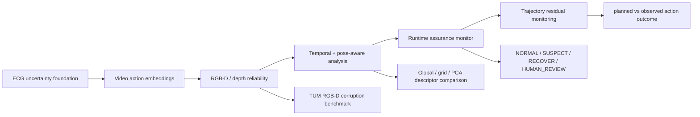

# Project Overview

This repository is a reliability-aware perception and action monitoring
prototype. It starts from a sequential video-action baseline, then extends the
same evidence pattern to RGB-D robot perception, runtime assurance, and
action-outcome residual monitoring.

## Core Question

Can embedding-space evidence, calibration analysis, and residual monitoring
identify when a learned perception-action system is unreliable enough to slow
down, recover, replan, or request human review?

## Pipeline

## Evidence Summary

| Layer | Dataset / setup | Key result | Interpretation |
|---|---:|---:|---|
| Synthetic 3D reliability | Synthetic depth corruptions | ROC-AUC 0.804 +/- 0.028 | Smoke evidence for embedding-risk scoring |
| TUM RGB-D corruption | 300 depth files, 1800 samples | source-paired ROC-AUC 1.000 | Controlled corruptions are detectable |
| TUM scene-conditioned baseline | Same TUM run | ROC-AUC 0.483 | Global clean references fail under camera motion |
| TUM temporal reliability | +/- 5 frame window | temporal excess ROC-AUC 1.000 | Local temporal normalization helps |
| Pose-aware global descriptor | TUM ground-truth poses | rotation corr. 0.061 | Global statistics are not pose-aware |
| Pose-aware grid descriptor | TUM ground-truth poses | rotation corr. 0.275 | Local layout improves rotation sensitivity |
| PCA depth descriptor | TUM ground-truth poses | rotation corr. 0.540 | Learned depth descriptors are more promising |
| Runtime monitor | TUM temporal risk scores | 1350 NORMAL, 423 SUSPECT, 27 RECOVER | Scores can become auditable runtime states |
| Calibration | TUM temporal risk scores | ROC-AUC 1.000, ECE gap 0.758 | Good ranking, poor probability calibration |
| Trajectory residual | Synthetic action failures | ROC-AUC 0.990 | Action-outcome residuals detect execution failures |

## What This Shows

- The project has a reproducible RGB-D reliability workflow on TUM RGB-D.
- Naive embedding distance can fail under normal camera motion.
- Local and learned descriptors improve pose-awareness, especially for rotation.
- Reliability scores can be converted into runtime states and recovery actions.
- Action-outcome residuals extend the project from perception to execution.

## What It Does Not Prove

- It does not prove closed-loop robot safety.
- Controlled corruptions do not replace real task failure labels.
- PCA descriptors are sequence-fitted baselines, not general pretrained models.
- Runtime state rules are auditable prototypes, not formal safety proofs.

## Supervisor Reading Guide

| Supervisor direction | Read first |
|---|---|
| Trustworthy ML / calibration | `docs/application_evidence_pack.md`, calibration section |
| Runtime assurance / formal methods | `docs/application_evidence_pack.md`, runtime monitor section |
| Medical / surgical robotics | `docs/final_report.pdf`, trajectory residual section |
| Embodied AI / navigation | TUM temporal and pose-aware sections in this overview |
| Transferability estimation | Descriptor comparison: global -> grid -> PCA |

## Best Next Experiment

Replace the PCA descriptor with a pretrained or task-supervised RGB-D/depth
encoder, then validate reliability against a dataset-native target such as SLAM
tracking quality, pose error, navigation progress, or tool trajectory logs.
