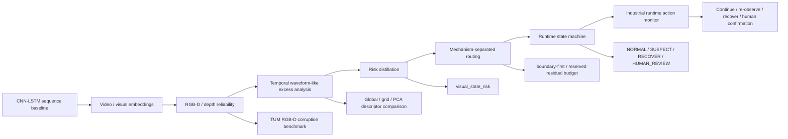
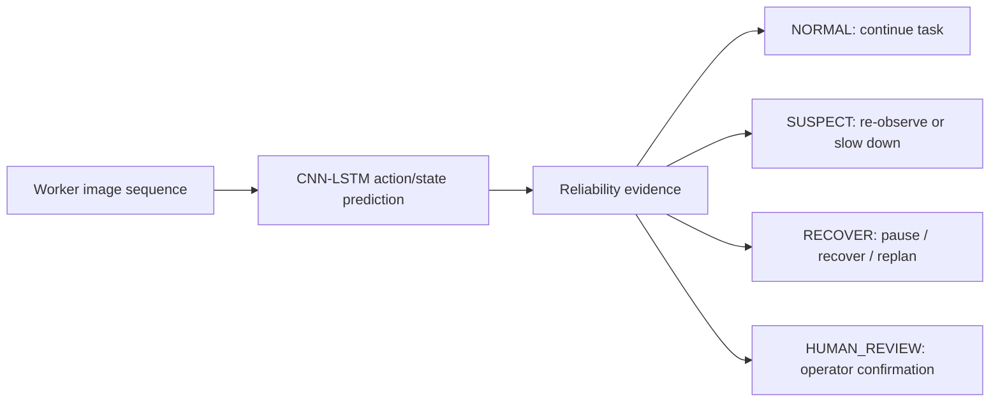
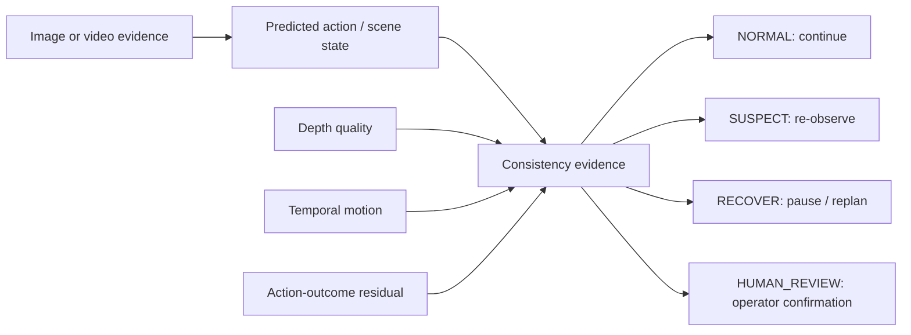

# Project Overview

This repository is framed as an industrial visual action recognition project
extended into reliability-aware robot perception. The research path is:

1. CNN-LSTM sequence perception.
2. Embedding and temporal-state diagnostics.
3. RGB-D/depth reliability under corruption and camera motion.
4. Waveform-like temporal excess analysis for abnormal state changes.
5. Runtime risk distillation and route-state monitoring.
6. Mechanism-separated hierarchical routing with a reserved residual budget.
7. Primary industrial runtime action monitoring.
8. Future visual-to-state consistency checking.

## Core Question

Can an industrial action-recognition model be upgraded with depth, temporal,
embedding, trajectory, calibration, and coverage-risk evidence so that a
prototype monitor can indicate when to continue, re-observe the worker, pause
or recover the robot action, or request human confirmation?

## Pipeline

## Evidence Summary

| Layer | Dataset / setup | Key result | Interpretation |
|---|---:|---:|---|
| Risk distillation | 1800 aligned visual/action samples | Random Forest distillation ROC-AUC 0.992 | Depth/temporal/embedding/trajectory evidence becomes `visual_state_risk` |
| Route evaluation | Distilled risk states | 1350 NORMAL, 433 SUSPECT, 17 RECOVER, 0 HUMAN_REVIEW | Risk maps to concrete autonomy actions |
| Outcome-linked validation | Risk vs downstream signals | Top 10% risk captures 100% RECOVER/HUMAN_REVIEW | The score is decision-relevant, not only fitted to the distillation target |
| Reserved-budget router | visual-state risk trace | 20% budget captures 66.7% high-risk target cases and 76.5% RECOVER/HUMAN_REVIEW | Scalar risk becomes route-specific runtime actions |
| Synthetic 3D reliability | Synthetic depth corruptions | ROC-AUC 0.804 +/- 0.028 | Smoke evidence for embedding-risk scoring |
| TUM RGB-D corruption | 300 depth files, 1800 samples | source-paired ROC-AUC 1.000 | Controlled corruptions are detectable |
| TUM scene-conditioned baseline | Same TUM run | ROC-AUC 0.483 | Global clean references fail under camera motion |
| TUM temporal reliability | +/- 5 frame window | temporal excess ROC-AUC 1.000 | Local temporal normalization helps |
| Pose-aware global descriptor | TUM ground-truth poses | rotation corr. 0.061 | Global statistics are not pose-aware |
| Pose-aware grid descriptor | TUM ground-truth poses | rotation corr. 0.275 | Local layout improves rotation sensitivity |
| PCA depth descriptor | TUM ground-truth poses | rotation corr. 0.540 | Learned depth descriptors are more promising |
| Runtime monitor | TUM temporal risk scores | 1350 NORMAL, 423 SUSPECT, 27 RECOVER | Scores can become auditable runtime states |
| Calibration | TUM temporal risk scores | ROC-AUC 1.000, ECE gap 0.758 | Good ranking, poor probability calibration |
| Trajectory residual | Synthetic action failures | ROC-AUC 0.990 | Action-outcome residuals detect execution failures |

## What This Shows

- The project is best described as an industrial action-recognition pipeline
  upgraded with a prototype reliability monitor.
- `visual_state_risk` distills heavier reliability evidence into a lightweight
  runtime score.
- Mechanism-separated routing keeps embedding, temporal, depth, trajectory, and
  progress evidence as different failure signals rather than collapsing every
  case into one undifferentiated review bucket.
- Naive embedding distance can fail under normal camera motion.
- Local and learned descriptors improve pose-awareness, especially for rotation.
- Reliability scores can be converted into runtime states and recovery actions.
- Action-outcome residuals extend the project from perception to execution.

## Industrial Runtime Action Monitoring

The primary scenario is an industrial workcell or human-robot collaboration
setting. The system recognizes worker actions or visual activity states, then
uses reliability evidence to decide whether the robot can act on that estimate.

This is the intended main project output. The current repository implements a
visual action-recognition model plus a proof-of-concept reliability monitor for
uncertain industrial perception states, not a validated robot controller.

## Future Extension: Visual-State Consistency

The next conceptual extension is a visual-to-state consistency monitor. In that
setting, camera evidence is first converted into an action or scene state. The
system then checks whether later visual evidence, temporal motion, depth
quality, and action-outcome residuals remain consistent with that state.

This is useful for industrial human-robot collaboration because a robot often
acts on a compact state estimate rather than on the raw image itself. It remains
a future extension in this repository; the current evidence supports a
prototype reliability monitor, not closed-loop consistency validation.

## What It Does Not Prove

- It does not prove closed-loop robot safety.
- Controlled corruptions do not replace real task failure labels.
- PCA descriptors are sequence-fitted baselines, not general pretrained models.
- Runtime state rules are auditable prototypes, not validated industrial
  control policies or formal safety proofs.
- Visual-state consistency checking is proposed as a next extension, not
  claimed as a completed external-framework validation.

## Technical Reading Guide

| Topic | Read first |
|---|---|
| Industrial action recognition | `modules/main.py`, `modules/model.py`, and `modules/readme.md` |
| Embedding and temporal diagnostics | `modules/embedding_analysis.py` and temporal sections in this overview |
| RGB-D reliability | TUM temporal and pose-aware sections in this overview |
| Calibration and coverage risk | `modules/calibration_analysis.py` |
| Runtime state monitoring | `modules/runtime_monitor.py` |
| Mechanism-separated routing | `docs/mechanism_separated_routing_upgrade.md` |

## Best Next Experiment

Replace the current proxy labels with task-native industrial evidence:
human-action misrecognition cases, worker-zone events, robot stop/replan logs,
near-miss annotations, perception dropouts, or real action-outcome residuals.
Then evaluate whether `visual_state_risk` predicts downstream failures and
reduces unsafe execution through re-observation, recovery, or human
confirmation.
